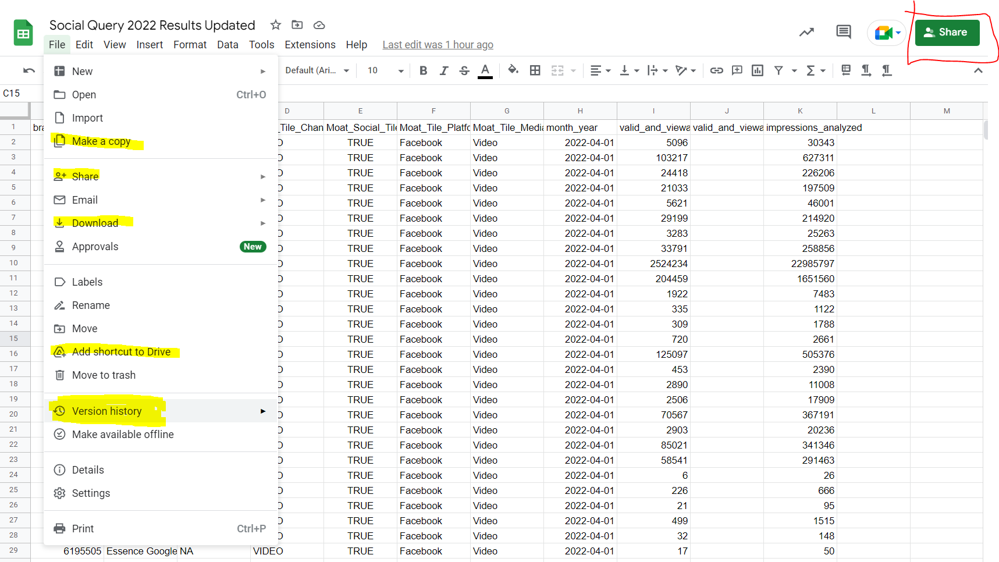

# BigQuery and R Studio Live Training

## Big Query

-   All projects for Advanced Analytics will be found in this schema: <https://console.cloud.google.com/welcome?project=essence-analytics-dwh>

    -   Clicking (Start New Query) on this link should take you to the explorer where you can search for `essence-analytics-dwh` and make sure you pin the project to your list of projects 
    -   Pinned Projects will show up under explorer and you should be able to view the various schema and tables associated with that project. There you can run and queries in editor. Save the views in BQ associated with that Query. Share query with other people and set a destination table for query if creating a permanent table. Be mindful of the amount of MBs the query will process! Very large queries can cost money.\
        \
    -   For our purposes we generally export the data provided by big query into a Domino Jupyter Notebook (not shown) or local R Studio Session with a BQ connection.\
        

#### Exercise 1

-   Try finding the table in the explorer in essence-analytics-dwh associated with the query:\
    `SELECT * FROM` \``essence-analytics-dwh.TrueNorth_Benchmarks.social_data_2022H2`\` `where month_year >= '2022-01-01'`

-   The data associated with this table can be found in two locations

    -   [Google Sheets](https://docs.google.com/spreadsheets/d/1OT7zoqbcnadQsR8ehHbvMfKn8mieWYa-dVaCOHFdhHI/edit#gid=12056137)\
    -   [Github CSV](https://github.com/dpatel-Essence/Brand_Report-AdHoc-Requests/blob/main/Social%20Query%202022%20Results%20Updated%20-%20Social%20Results%202022.csv)

------------------------------------------------------------------------

## Google Sheets

-   Some features that are used a decent amount include sharing a doc, making a copy of things you only have read access to (such as templates), downloading to CSV/Excel/JSON, version control. \
-   Other features in the data tab that are often used are creating filters, projecting parts of a sheet, data cleanup, text to columns, and connecting a Gsheet back to BigQuery. \
-   Lastly, adding comments or insering links to a cell\
    

------------------------------------------------------------------------

## RStudio

### Projects instead of using Working Directory! - Setting Up Projects

-   In 2022, [many practitioners (including the person who created R4DS)](https://r4ds.had.co.nz/workflow-projects.html) of R prefer the use of projects instead of setting a working directory. A project will house all data, scripts, notebooks, and output associated with that workflow. Projects will appear in the top right, and you can switch them at whim and it will load the workspace you last used for that project including notebooks and your global environment.
-   This goes hand in hand with creating a Github folder associated with the project. Lets see how a project can be created in a few minutes.

------------------------------------------------------------------------

#### Step 1. Setting Up a blank Github Folder locally

-   The easiest way to do this is set up a blank repository first locally and then associate a project with the repository instead of doing everything through R.


------------------------------------------------------------------------

#### Step 2. Create a new project associated with that blank repository (file -> new project)


------------------------------------------------------------------------

#### Step 3. Choose Existing Directory not Version Control Directory

The feature works, it just seems to be a more roundabout way if your goal is to have version control.\


------------------------------------------------------------------------

#### Step 4. Choose Location of where local repository is located and click create project


------------------------------------------------------------------------

### Exercise 2 - Create your own project related to this training with or without version control.

Use can download the CSV of the Social data or create your own folders!

------------------------------------------------------------------------

### Commiting Project Updates in 3 Easy Ways

1.  Through Github Desktop - after publishing to your Essence account. This is the easiest but has no terminal associated.\
    

------------------------------------------------------------------------

2.  Through VSCode - if you open a project folder that is linked to a Github Repo, VScode will automatically link it through version control. The terminal is also available for git operations. 

------------------------------------------------------------------------

3.  Through RStudio (not recommended for your Essence account) - Git Tab. Sometimes your local Rstudio may not have the correct permissions to stage, commit, and push changes, but you can view history and use the terminal for git operations. 

------------------------------------------------------------------------

### [YAML - click for documentation](https://bookdown.org/yihui/rmarkdown/html-document.html)

The YAML is your configuration options. It appears before any code or markdown is written. Indentation is important. Additional documentation is provided if you click the header link but you can use something similar to what I use for my notebooks:


The most important thing is to make sure the output is `html_notebook` otherwise you can't see any previews and R won't make html file for you.

------------------------------------------------------------------------

### [Writing things in markdown and common options for code Chunks](https://www.rstudio.com/wp-content/uploads/2015/02/rmarkdown-cheatsheet.pdf)

Refer to this for making headers etc..., in markdown format or just use the visual markdown editor! There are some HTML elements that can also be incorporated and CSS styling.

------------------------------------------------------------------------

## Configuring the Output of Setup Chunk

CTRL+ALT+I or typing \`\`\`{r}\`\`\` creates new R code chunks. These can be named and have different ways to include options. By default the first code chunk is your setup code (can be changed in options). Typically this has all the options you want to include globally and can include your libraries.

*Press CTRL + Enter to run the following code in your RMD*

```{r setup, include=TRUE}
#note: normally include = FALSE for this
knitr::opts_chunk$set(echo = TRUE) #all code chunks by default will be shown
options(knitr.table.format = "html") #table format
options(digits=5) #set digits in numbers
options(scipen = 100) #digits show before using scientific notation
knitr::opts_chunk$set(tidy.opts=list(width.cutoff=80), tidy=TRUE)
#install.packages("pacman")
library(pacman) #for quick load/install of packages
p_load(
  dplyr, readr, tidyverse,forcats,purrr,lubridate, # reading in data
  janitor, sqldf,googlesheets4, # additional tools for dealing with data
  skimr,
  rqdatatable, #
  splitstackshape,stringr, #string related libraries
  kableExtra, ggplot2, plotly,echarts4r,ggpubr,scales,RColorBrewer,ggthemes, #for visualization of data
  reticulate #for using python
)
```

------------------------------------------------------------------------

## Loading Data

------------------------------------------------------------------------

### Method 1: Directly from the Google Sheet

Note this is much slower than importing from a CSV but useful when working with a lot of google sheets.

You can specify range, sheet, and other options. [CheatSheet Here](https://github.com/rstudio/cheatsheets/blob/main/data-import.pdf)

```{r data import Gsheet, results='hide'}
Social_2022_raw_data = googlesheets4::read_sheet(
  "https://docs.google.com/spreadsheets/d/1OT7zoqbcnadQsR8ehHbvMfKn8mieWYa-dVaCOHFdhHI/edit#gid=12056137"
  , sheet = 'Social Results 2022' , range = 'A1:K98329')
```

------------------------------------------------------------------------

### Method 2: A CSV from your project folder

If you have your project set up correctly, it should be auto complete when you begin your quotes (press tab) for exporting data in your code chunk.\


```{r data import csv}

Social_2022_raw_data <- readr::read_csv("DATA/Social Query 2022 Results Updated - Social Results 2022.csv")

```

------------------------------------------------------------------------

### Summary of the Data

There are several functions and libraries that can be used to summarize the data quickly.

```{r summary}
summary(Social_2022_raw_data)
```

------------------------------------------------------------------------

```{r glimpse}
dplyr::glimpse(Social_2022_raw_data)
```

------------------------------------------------------------------------

```{r str}
str(Social_2022_raw_data)
```

------------------------------------------------------------------------

```{r dim}
dim(Social_2022_raw_data)
```

------------------------------------------------------------------------

skim creates a data frame object which can be used to more easily narrow down problems. #### Exercise 3 - 


------------------------------------------------------------------------

### Exercise 3 - What are 2 issues that you can find based on the following output

```{r skim}
skimr::skim(Social_2022_raw_data)
```

------------------------------------------------------------------------

### Piping Data

One very common technique in R is using a data pipe to make temporary data frames and do multiple operations without saving the objects to our global environment. This keeps the environment small, our rdata will also be small.\
There are 2 ways:

-   `%>%` (requires the `dplyr` package to be loaded CTRL + SHIFT + M hotkey)

-   `|>` (native to base R)

A pipe uses the previous data source to fill in any function arguments

```{r}
Social_2022_raw_data %>% 
  head()
```

------------------------------------------------------------------------

### Initial Issues from data from data read-in

1.  Data for dates is read in as character instead of date. The `Lubridate` library has options to fix this.

```{r}
Social_2022_raw_data %>% 
  dplyr::mutate( #mutate creates new variables
    date_fixed = lubridate::mdy(month_year) #converts date - month - year character to date format
  ) %>%
  select(date_fixed)
```

------------------------------------------------------------------------

2.  NA region is read in as missing instead of as NA. Readr can be used to prevent this, but several other variables are using NA for missing so we will modify ipso facto.

```{r}
Social_2022_raw_data %>% 
  dplyr::mutate( #mutate creates new variables
    Moat_Tile_Region_fixed = case_when(
      !is.na(Moat_Tile_Region)  ~ Moat_Tile_Region,
      TRUE ~ 'NA'
    )  #replace_na is also an option
  ) 
```

------------------------------------------------------------------------  

### Creating New Dataset  
Assigning both changes to a new dataset, cleaning names of dataset using `janitor::clean_names()`, and only keeping variables of interest, Additionally Created a variable for Quarter.

```{r}
Social_2022_processed_data <-
  Social_2022_raw_data %>% 
    dplyr::mutate( #mutate creates new variables
      moat_tile_region_fixed = dplyr::case_when(
        !is.na(Moat_Tile_Region)  ~ Moat_Tile_Region,
        TRUE ~ 'NA'
      ),
      date_fixed = lubridate::mdy(month_year),
      quarter_fixed = lubridate::quarter(date_fixed)
    ) %>% 
    janitor::clean_names() %>% 
    dplyr::select(
      moat_tile_region_fixed, date_fixed, quarter_fixed, moat_tile_channel, moat_tile_platform, moat_tile_media_type, valid_and_viewable, impressions_analyzed
  ) 

Social_2022_processed_data %>%
  skimr::skim() %>%
  as.data.frame() # optional if automating checks
```

------------------------------------------------------------------------

### Checks on the data - using summarize function and group by

Valid Impressions should be less than Total Impressions. There are a few cases where this principle doesn't hold.

```{r}
Social_2022_processed_data %>% 
  dplyr::mutate(
    flag_impression = dplyr::case_when(
      valid_and_viewable > impressions_analyzed ~ 1,
      TRUE ~ -1
    )
  ) %>% 
  dplyr::group_by(flag_impression) %>% 
  dplyr::summarise(
    count = sum(flag_impression) #summarize can use custom aggregation functions that you create!
  ) %>% ungroup() #useful if using the dataset again - not necessary here
```

------------------------------------------------------------------------

All the cases are for twitter which we aren't interested in

```{r}
Social_2022_processed_data %>% 
  dplyr::mutate(
    flag_impression = dplyr::case_when(
      valid_and_viewable > impressions_analyzed ~ 1,
      TRUE ~ 0
    )
  ) %>% 
  dplyr::filter (flag_impression == 1 & moat_tile_platform != 'Twitter') # '&' is used as a 'and' operator while '|' is used as an 'or' operator
```

------------------------------------------------------------------------

Timing of the data should only be in 2022 (we can see this from skimmed data, but to double check)

```{r}
Social_2022_processed_data %>% 
  dplyr::summarize(
    Min_date = min(date_fixed),
    Max_date = max(date_fixed)
  )
```

------------------------------------------------------------------------

Channels and Platforms - unique values through several different ways. There are also several different ways to

```{r}
Social_2022_processed_data %>% 
  dplyr::select(moat_tile_channel) %>% 
  unique()
```

------------------------------------------------------------------------

There are also base functions which can be used for this purpose although they don't produce data frames

```{r}
unique(Social_2022_processed_data$moat_tile_channel)

unique(Social_2022_processed_data[["moat_tile_platform"]]) #useful for creating functions when column name is specified.

unique(Social_2022_processed_data$moat_tile_channel) %>% as.data.frame()
```

------------------------------------------------------------------------

This is the dplyr way to get all unique combinations and counts

```{r}
Social_2022_processed_data %>%
  dplyr::group_by(moat_tile_platform, moat_tile_channel) %>%
  dplyr::summarise(
    distinct_combos = dplyr::n_distinct(moat_tile_platform, moat_tile_channel),
    distinct_combos2 = n()
  )
```

------------------------------------------------------------------------

### Creating Summary Group_by Pivotable Table

One thing to note is that there are many ways to apply group_bys, selects, filters, summaries, mutates across all variable types (for example all characters or dates or starts with a prefix). A minus will also remove a variable from a select. Specific column names can also be selected with one_of.

```{r}
Social_2022_summarized_data <-
  Social_2022_processed_data %>%
  group_by(
    dplyr::across(where(lubridate::is.Date)),
    quarter_fixed,
    dplyr::across(dplyr::starts_with("moat"))
  ) %>%
  dplyr::ungroup(moat_tile_media_type) %>%
  dplyr::select(-moat_tile_media_type) %>%
  summarize(
    valid_and_viewable_imp = sum(valid_and_viewable),
    impressions = sum(impressions_analyzed),
    valid_and_viewable_rate = sum(valid_and_viewable) / sum(impressions_analyzed)
  ) %>%
  dplyr::ungroup() %>%
  dplyr::arrange_all()
```

------------------------------------------------------------------------

The `kableExtra` package provides a nice way to look at html tables

```{r}
Social_2022_summarized_data %>% 
  dplyr::select(-quarter_fixed,-valid_and_viewable_imp,-impressions) %>% 
  dplyr::slice_head(n = 10) %>% 
  kableExtra::kbl() %>% 
 kableExtra::kable_material(c("striped", "hover","condensed","responsive"),full_width = F,fixed_thead = T)
```

------------------------------------------------------------------------  

### Exercise 4 - Group this data set further  
Get Valid/Viewable rate at the quarter, channel, platform level. Filter platform so twitter is excluded.  

```{r}

### Answer goes here , your table should have 4 columns minimum!

```


------------------------------------------------------------------------

### Outputting Data as a Googlesheet

It will be similar to reading a sheet. Be careful as this will over-ride the existing sheet. Good Practice is to leave commented out after running.

```{r}
#WRITING SHEETS WILL BE COMMENTED OUT UNLESS REFRESH IS NECESSARY
#write_sheet(Social_2022_summarized_data, ss = 'https://docs.google.com/spreadsheets/d/1OT7zoqbcnadQsR8ehHbvMfKn8mieWYa-dVaCOHFdhHI/edit#gid=12056137',
#           sheet = 'Aggregated Data')
```

------------------------------------------------------------------------

### Other tips

-   Dplyr Cheatsheet (help -> cheatsheets in menu), joins, distinct, counts, slicing, renaming, bind_rows as an alternative to rbind, 

-   [Janitor Functions](https://cran.r-project.org/web/packages/janitor/vignettes/janitor.html) - more than just clean names()  

-   Tabsets, Pseudo-HTML, better looking tables and other formatting options

-   SQL in R - Sqldf package

-   Alt for multiple commenting out or un-commenting selections. Hotkey for commenting all code.

-   Styling code (addins -> style selection)

-   Easier to read code chunk options

-   Using the Visual Markdown Editor and outline mode

-   Tab Autocomplete

-   Factors, ordering/leveling factors, usefulness in graphing - forcats package

-   Melting and reshaping data - making data wider and longer - pivot_wider, pivot_longer, and melt from reshape2
